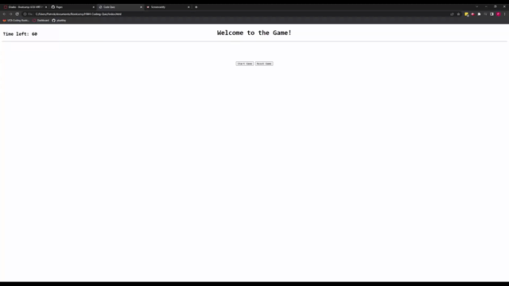

# HW4-Coding-Quiz

## Deploy Link

https://pbarkley.github.io/HW4-Coding-Quiz/

## Installation

- Click 'Deploy Link' above
            -OR-
- git clone git@github.com:pbarkley/HW4-Coding-Quiz.git

## Description

This is a code quiz. Pressing start game will display the first question and start the timer. Click the correct answer to move to the next question. Guessing incorrectly will subtract 5 seconds from your time. The quiz will end when either there is no time left in the timer or all five questions have been answered correctly. Once you finish the quiz, you will be able to enter your initials. Your highscore will be saved to your local storage as your initials along with the time you have remaining. Clicking reset quiz will clear the quiz and reset the timer. 

## Webpage Gif

## Credits

- Pat Barkley